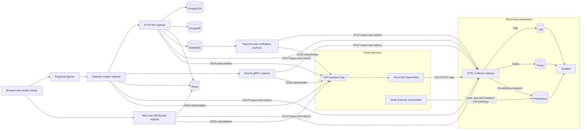

# Bookit GitOps operations guide

This repository is the desired-state repository for Bookit. Application source,
Docker builds, and GitHub Actions live in `bhatvinay7/bookit`; Argo CD reads only
this repository.

## Promotion model

| Application branch | GitHub environment | GitOps branch | Overlay | Target |
|---|---|---|---|---|
| `dev` | `development` | `dev` | `apps/overlays/dev` | development clusters |
| `main` | `production` | `main` | `apps/overlays/prod` | production clusters |

Never merge an automated image update from `dev` directly into production.
Promote application code through a reviewed `dev -> main` pull request. The
`Promote Tested Images to Production` workflow accepts a successfully built dev
commit, resolves its image tags to immutable GHCR digests, and opens a GitOps
pull request against `main`. Production never rebuilds or consumes a floating
`latest` tag.

Protect `bookit-k8s/main` in GitHub Settings -> Branches (or Rulesets) with:

- require a pull request before merging;
- require at least one approval and dismiss stale approvals;
- require the `Render dev and production overlays` status check;
- require conversations to be resolved;
- block force pushes and deletions;
- restrict direct pushes to `main`, including GitHub Actions;
- require signed commits if every authorized maintainer supports them.

The promotion workflow pushes only `promote/*` branches. Branch protection is a
GitHub repository setting and cannot be enforced by YAML stored in this repo.

## Repository layout

```text
apps/base/                              shared stateless workloads
apps/overlays/dev/                     development configuration
apps/regions/dev/us-east/              dev regional app and ciphertext
apps/regions/prod/us-east/             prod US regional app and ciphertext
apps/regions/prod/eu-west/             prod EU regional app and ciphertext
infra/base/                             shared cluster services
infra/overlays/dev/                    development infrastructure
infra/overlays/prod/                   production infrastructure
argocd/dev-apps.yaml                   Argo CD dev ApplicationSets
argocd/prod-apps.yaml                  Argo CD prod ApplicationSets
scripts/seal-cluster-secrets.sh        cluster-specific secret sealing
```

The environment overlay owns image tags and non-secret environment
configuration. CI derives `BOOKIT_ENVIRONMENT` and `BOOKIT_REGION` from the
selected GitHub environment and regional deployment matrix, then seals both
values into each cluster's runtime Secrets. A regional overlay contains only
the region label and SealedSecret ciphertext encrypted for that cluster.

## Runtime and observability architecture

Bookit uses regional, stateless application replicas in namespace `bookit` and
cluster-local observability services in namespace `monitoring`. Argo CD applies
the desired state; it is not in the request or telemetry data path.



### Logs

Rust services write one JSON object per line to standard output. Kubernetes'
container runtime writes those records to `/var/log/containers`. One Fluent
Bit pod runs on every node, tails the local CRI files, attaches pod, namespace,
container, label and stream metadata, and forwards logs over OTLP HTTP to the
collector. Fluent Bit uses a disk-backed tail database and filesystem buffering
so a short collector outage does not immediately lose its read position.

The collector applies memory limiting and batching before sending logs to Loki.
Promtail is disabled deliberately: enabling Promtail and Fluent Bit together
would ingest and bill for every log twice. Loki has a 50 GiB persistent volume
in the baseline configuration. Log records must not contain credentials,
tokens, payment data or raw personal information.

### Traces

Rust services initialize a shared OTLP tracer with `service.name`,
`deployment.environment`, and `cloud.region` resource attributes. HTTP servers
create spans around inbound requests, and the collector batches and retries
exports to Tempo. Tempo is registered as a Grafana data source.

W3C Trace Context is the propagation standard. Any new HTTP, gRPC, RabbitMQ or
Redis-stream boundary must inject `traceparent` when sending and restore it when
receiving. Database, cache, search and broker operations should create child
spans named by system and operation—for example `db.system=postgresql` and
`db.operation.name=SELECT`—without recording SQL parameters or secret-bearing
URLs. The current shared setup guarantees request-level spans; complete
driver-level query spans require wrapping each client operation or adopting a
compatible instrumented client. Treat that as a release criterion before
claiming complete query tracing.

Tempo's baseline manifest uses node-local `/tmp` block and WAL storage. It is
suitable for development and short-lived diagnostics, not durable production
history. Production must move Tempo to object storage, run distributed
components, and test retention and recovery.

### Metrics and CPU monitoring

`kube-prometheus-stack` installs Prometheus Operator, Node Exporter,
kube-state-metrics and the normal Kubernetes scrape integrations. These provide
host CPU, memory, disk and network metrics plus pod/container CPU throttling,
working set, restarts and desired-versus-ready replica state. Metrics Server is
separate: it supplies the live Resource Metrics API used by HPAs and
`kubectl top`, but it does not retain historical Prometheus data.

Applications export OTLP metrics to the collector. A dedicated ServiceMonitor
scrapes the collector's port `8889`; Prometheus discovery is enabled across
namespaces. Prefer OTLP application metrics for request rate, errors, latency,
queue depth, lock contention and booking outcomes. Do not advertise a
per-service `/metrics` endpoint unless that process actually serves it.

### Scaling and capacity model

There is no honest universal requests-per-second or telemetry-events-per-second
number in source control: payload size, cardinality, sampling, node disk speed,
database latency and retention all change capacity. The checked-in values are a
safe baseline to load-test, not a throughput guarantee.

| Layer | Horizontal unit | Baseline protection | Primary scale limit and control |
|---|---|---|---|
| Stateless API/gateway/search | Pod | CPU requests/limits and HPAs | Database pools and downstream latency; scale replicas only with matching connection budgets |
| WebSocket | Pod | Regional Redis coordination | Open connections, file descriptors and reconnect storms; use connection-aware load tests and graceful draining |
| Workers | Pod/consumer | RabbitMQ durability and bounded concurrency | Queue lag and downstream write rate; scale on queue depth, not CPU alone |
| Fluent Bit | One pod per node | 50 MiB memory buffer plus node-local filesystem backlog | Per-node log bytes/sec and disk; enforce log levels, rotation and payload limits |
| OTEL Collector | Two replicas | 1 GiB limit each, 768 MiB limiter, 2,048-item batches, 10,000-item trace queues | Signal bytes/sec and exporter latency; shard or autoscale collectors and watch refused/dropped telemetry |
| Prometheus | One stack per cluster | 15-day retention | Active series × scrape frequency × retention; control labels/cardinality, add persistent storage, then shard or use remote-write |
| Loki | Single persistent baseline | 50 GiB PVC | Compressed log bytes/day × retention; move to object storage and distributed Loki before sustained high volume |
| Tempo | Single ephemeral baseline | Batched collector exports | Spans/sec × average span size × retention; add sampling and object-backed distributed Tempo |

Capacity planning starts with measurements. Load-test expected peak traffic plus
failure bursts, then record: request and error rate, p95/p99 latency, active
Prometheus series, OTLP accepted/refused/dropped items, collector queue use,
Fluent Bit retry backlog, Loki bytes/day, Tempo spans/sec, queue lag, database
connections, CPU throttling and memory working set. Keep at least 30% headroom at
the tested peak and alert before queues or storage reach their hard limits.

Control observability growth with these rules:

- never use user IDs, order IDs, URLs with identifiers, or unbounded error text
  as Prometheus labels;
- sample successful high-volume traces while retaining errors and slow traces;
- set environment-specific log levels and rate-limit repetitive errors;
- separate development and production retention and storage;
- use object storage and multi-replica Loki/Tempo components before calling the
  stack highly available;
- alert on telemetry refusal/drop counters, not only application health.

### Failure behavior

Application requests do not synchronously depend on Loki, Tempo or Prometheus.
If the collector is unavailable, Fluent Bit buffers logs on the node and OTLP
SDK/collector queues absorb bounded bursts; once those bounds are exhausted,
telemetry is dropped rather than blocking booking traffic. Prometheus continues
scraping node and Kubernetes metrics independently. A node loss can still lose
that node's unsent Fluent Bit backlog, and the baseline Tempo storage is lost
with its pod, which is why remote durable storage is required for production.

## GitHub environments and secrets

Create two GitHub environments in the **bookit application repository**:
`development` and `production`. Production should require reviewers. Use the
same secret names in each environment but different values.

Required repository or environment secrets:

- `GITOPS_REPO`: normally `bhatvinay7/bookit-k8s`.
- `GITOPS_TOKEN`: fine-grained token with Contents read/write on only the
  GitOps repository.
- `KUBECONFIG`: base64 or plaintext multi-context kubeconfig containing only
  the clusters for that environment.
- `GHCR_PULL_TOKEN`: read-only package token used to produce `ghcr-secret`.
- `DATABASE_URL`, `REPLICATION_URL`, `MONGODB_URL`, `REDIS_URL`,
  `RABBITMQ_URL`, `GRPC_SERVER_URL`.
- `SLOT_NAME`, `PUBLICATION`, `INVITATION_ENCRYPTION_KEY`.
- `SMTP_HOST`, `SMTP_PORT`, `SMTP_SECURE`, `SMTP_USER`, `SMTP_PASS`,
  `SMTP_FROM`.
- `GOOGLE_CLIENT_ID`, `GOOGLE_CLIENT_SECRET`.
- `CLOUDINARY_CLOUD_NAME`, `CLOUDINARY_API_KEY`,
  `CLOUDINARY_API_SECRET`.
- `CLOUDFLARE_R2_ACCOUNT_ID`, `CLOUDFLARE_R2_ACCESS_KEY_ID`,
  `CLOUDFLARE_R2_SECRET_ACCESS_KEY`, `CLOUDFLARE_R2_ENDPOINT`,
  `CLOUDFLARE_R2_BUCKET`, `CLOUDFLARE_R2_PUBLIC_URL`.
- `NEXT_PUBLIC_API_URL`, `NEXT_PUBLIC_SOCKET_URL` and the remaining frontend
  build-time secrets used by `.github/workflows/ci-cd.yaml`.

Required GitHub environment variables:

| Environment | `DEPLOY_REGIONS` | `KUBE_CONTEXTS` |
|---|---|---|
| development | `us-east` | `bookit-dev-us-east` |
| production | `us-east,eu-west` | `bookit-prod-us-east,bookit-prod-eu-west` |

The two lists are positional and must have equal lengths. Context names must
exactly match `kubectl config get-contexts -o name` in that environment's
`KUBECONFIG`.

Do not use one kubeconfig across development and production. Use service
accounts with the minimum bootstrap permissions, short-lived credentials where
the provider supports them, and GitHub environment approval for production.

## Sealed Secrets lifecycle

Each cluster runs its own Sealed Secrets controller and therefore owns a
different encryption key. The CI workflow calls
`scripts/seal-cluster-secrets.sh` once per kubeconfig context. It writes only
encrypted `SealedSecret` resources under that cluster's regional overlay.

Bootstrap order for a new cluster:

1. Add the cluster context to the correct environment kubeconfig.
2. Install Argo CD and the Sealed Secrets controller.
3. Wait for `sealed-secrets-controller` to become Ready.
4. Add a regional overlay and an ApplicationSet generator element.
5. Add the matching region and context to the GitHub environment variables.
6. Run the application CI workflow to generate and commit ciphertext.
7. Confirm `backend-secrets`, `frontend-secrets`, `bookit-secrets`, and
   `ghcr-secret` exist in namespace `bookit`.
8. Sync the regional Argo CD application.

Ciphertext is safe to store in Git, but controller private keys are not. Back up
each controller key to a restricted secret manager. Secret rotation means
updating the GitHub environment secret and rerunning CI. Never commit a
plaintext Kubernetes Secret, `.env`, or kubeconfig.

## Argo CD and cluster registration

The current dev cluster uses the in-cluster API URL. Production defines an
in-cluster US endpoint and an example EU endpoint in `argocd/prod-apps.yaml`.
Replace example URLs with real Argo CD cluster registrations before bootstrap:

```bash
argocd cluster add bookit-prod-us-east --name prod-cluster-us-east
argocd cluster add bookit-prod-eu-west --name prod-cluster-eu-west
argocd cluster list
```

The names, URLs, ApplicationSet elements, and kubeconfig contexts are separate
identifiers; verify all four. Prefer one Argo CD control plane per environment.
If a single production Argo CD manages both regions, make the control plane HA
and ensure a regional outage does not prevent recovery of the surviving region.

Automated prune and self-heal are enabled. Production changes should still be
protected by the GitHub environment review and branch protection on `main`.

## Database topology, synchronization, and backups

Treat multi-region application deployment and multi-region database deployment
as separate designs. Kubernetes database operators provide HA inside one
cluster; applying identical custom resources to two clusters does **not** create
cross-region replication.

Recommended production topology:

- PostgreSQL: one write region, synchronous replicas only within that region,
  and asynchronous physical/logical replication to the standby region. Promote
  through an explicit runbook to prevent split brain.
- MongoDB: use a replica set spanning supported failure domains only when
  latency and operator support have been validated; otherwise use one primary
  region plus backup/restore or a managed multi-region service.
- Redis: keep caches regional. Do not use cache replication as authoritative
  data synchronization.
- RabbitMQ: keep queues regional and use federation/shovel only for explicitly
  designed event flows. Do not stretch a normal quorum queue across high-latency
  regions.

`infra/features/operator-db/multi-region/postgres-operator.yaml` and
`mongodb-operator.yaml` are optional database custom resources, not operator
installers. Install their compatible operators before enabling the feature.
The same package pins and installs the ECK 3.5.0 CRDs/operator and creates a
three-node Elasticsearch 9.5.0 cluster with 50 GiB per node. ECK exposes it as
`bookit-elasticsearch-es-http.bookit.svc.cluster.local:9200`. Internal HTTP TLS
and Elasticsearch authentication are disabled because the current search
client does not load an ECK CA or credentials; keep that Service cluster-only
and enforce namespace NetworkPolicies. Enable ECK authentication and TLS before
allowing any untrusted workload or external route to reach it.

The entire `infra/features/operator-db` package is excluded from the default
base so managed cloud URLs do not accidentally compete with in-cluster data
services. Because the package installs cluster-scoped ECK CRDs and RBAC, its
Argo CD application needs permission to manage cluster-scoped resources.
Install compatible PostgreSQL, MongoDB, and Redis CRDs/operators first and pin
supported versions. Values such as `${CLOUDFLARE_R2_ENDPOINT}` inside a Kubernetes manifest are not expanded by
Kustomize; environment overlays must patch the non-secret endpoint and bucket
fields before enabling operator-managed R2 backups. Credentials remain in the
cluster-specific `bookit-secrets` SealedSecret. S3 tools receive AWS-named
aliases derived from the canonical `CLOUDFLARE_R2_*` GitHub secrets.

`db-backup-cronjob.yaml` runs `pg_dump`/`mongodump` into a pod-local shared
volume and uploads completed artifacts to Cloudflare R2 with rclone. This is a
logical off-cluster copy, but it is not sufficient by itself. Do not consider
database backup complete until all of these pass:

- encrypted upload to an environment-specific, versioned R2 bucket;
- separate prefixes for environment, cluster, database, and timestamp;
- retention and object-lock policy independent of the cluster;
- weekly full plus daily incremental/differential schedule where supported;
- backup success/failure metrics and alerts;
- documented credentials with write-only backup and read-only restore roles;
- scheduled restore tests into an isolated cluster;
- measured RPO and RTO, recorded after every recovery exercise.

Avoid running duplicate logical backup schedules against the same primary from
every region. Elect one backup source and keep a second provider-native snapshot
policy if available.

### Stateful Services Helm Chart

`charts/stateful-services` is a dynamic Helm chart that handles database deployments across single or multi-region setups. It is deployed automatically via the `argocd/stateful-applicationset.yaml` ArgoCD ApplicationSet.

This architecture offers granular cloud provider controls:
- **Redis & RabbitMQ:** Always deploy locally as custom highly-available StatefulSets.
- **PostgreSQL & MongoDB:** Evaluated dynamically based on your environment's cloud preference. If `USE_CLOUD_PROVIDER` is true, the chart provisions an `ExternalName` Service proxying traffic to your SaaS databases. If false, it falls back to custom in-cluster StatefulSet deployments.

**Integrated S3 Backups:**
When PostgreSQL or MongoDB are deployed as custom resources (i.e. `useCloudProvider=false`), the Helm chart automatically injects `postgres-backup` and `mongodb-backup` CronJobs. These run daily and use `rclone` to back up database dumps directly to your Cloudflare R2 bucket (`CLOUDFLARE_R2_BUCKET`), leveraging the secrets injected from your `bookit-secrets` SealedSecret.

Before using custom deployments, ensure you seal a `custom-db-ha-secrets` Secret in the target `bookit` namespace with these keys:

- `mongodb-root-password`, `mongodb-replica-set-key`, `mongodb-exporter-uri`;
- `postgres-admin-password`, `postgres-password`, `repmgr-password`,
  `postgres-exporter-dsn`, `pgpool-admin-password`;
- `rabbitmq-erlang-cookie`, `rabbitmq-username`, `rabbitmq-password`;
- `redis-password`.

**Multi-Region Behavior:**
If multi-region is enabled, ArgoCD automatically labels and targets both primary and secondary clusters, creating independent database instances in each region. If disabled, it targets only the primary cluster. Wait for `deploy-stateful-services` to apply successfully before routing traffic.

## Global load balancing and failover

ExternalDNS publishes Kubernetes ingress/service addresses; it does not provide
health-checked global traffic steering. Put a managed global load balancer or
authoritative DNS health-check service in front of regional ingress endpoints.

Use these pools:

- development: `dev.boookit.shop` -> dev US ingress only;
- production primary: `boookit.shop`, `api.boookit.shop`,
  `ws.boookit.shop`, `grpc.boookit.shop` -> US pool;
- production failover: the same hostnames -> EU pool after health checks fail.

Use `/health` or `/readyz` endpoints that test required dependencies without
performing writes. WebSocket and gRPC health checks need protocol-appropriate
configuration. Keep DNS TTL low enough for the target RTO but not so low that
resolver traffic becomes excessive. Database writer promotion must happen
before directing write traffic to the standby region.

The checked-in ExternalDNS manifest is currently configured for AWS-compatible
DNS and contains no credentials. Select exactly one DNS provider, seal its
credentials per environment, give each cluster a unique TXT owner ID, and test
record ownership before enabling deletion (`policy=sync`).

## Metrics, logs, traces, and alerting

Metrics Server remains in `infra/base` because the application defines CPU
HPAs. It supplies the Kubernetes Resource Metrics API and `kubectl top`; it does
not replace Prometheus. If the Kubernetes provider already installs Metrics
Server, remove this repository's copy from the relevant infrastructure overlay
to avoid duplicate APIService ownership.

The observability stack consists of Prometheus/Grafana, OpenTelemetry, Tempo,
Loki, and application ServiceMonitors. Before production rollout:

- use environment/region labels on every signal;
- separate dev and prod alert routes and credentials;
- use persistent object storage and retention appropriate to the environment;
- alert on Argo sync failure, pod availability, HPA saturation, certificate
  expiry, backup failure, replication lag, queue depth, and regional ingress;
- build SLOs for availability, latency, error rate, and booking success;
- verify dashboards contain Bookit metrics—the legacy monitoring ConfigMap
  still contains old `chess_*` examples and must not be treated as complete.

## Deployment and recovery checklist

Development:

1. Push application changes to `dev`.
2. Confirm validation and image builds succeed.
3. Confirm the GitOps commit lands on `bookit-k8s/dev` only.
4. Confirm ciphertext was sealed against the dev context.
5. Wait for the dev Argo applications to become Healthy and Synced.
6. Run smoke, booking, WebSocket, gRPC, and rollback tests.

Production:

1. Open and approve the application `dev -> main` PR.
2. Run `Promote Tested Images to Production` with the full tested dev SHA and
   only the services built at that SHA (or `all` after a full dev build).
3. Enter `PROMOTE-PRODUCTION` and approve the GitHub `production` environment.
4. Review the generated `bookit-k8s/main` PR and its resolved image digests.
5. Merge only after the GitOps render check and required approval pass.
6. Sync the secondary region first and run smoke tests.
7. Sync the primary region and observe SLO/error-budget dashboards.
8. Enable or update global traffic only after regional health is proven.
9. Record the source SHA, image digests, GitOps commit, database migration, and
   rollback point.

Recovery must be rehearsed. A regional exercise is successful only when the
database role, application traffic, secrets, queues, monitoring, and rollback
are all verified—not merely when pods are Running.

## Validation commands

Run before every GitOps PR:

```bash
kubectl kustomize apps/regions/dev/us-east >/dev/null
kubectl kustomize apps/regions/prod/us-east >/dev/null
kubectl kustomize apps/regions/prod/eu-west >/dev/null
kubectl kustomize infra/overlays/dev >/dev/null
kubectl kustomize infra/overlays/prod >/dev/null
kubectl apply --dry-run=client -f argocd/dev-apps.yaml
kubectl apply --dry-run=client -f argocd/prod-apps.yaml
```

For cluster readiness, also run `kubectl top nodes`, `kubectl get hpa -A`,
`kubectl get applications,applicationsets -n argocd`, and a restore test. A
successful manifest render proves syntax and composition, not runtime safety.
